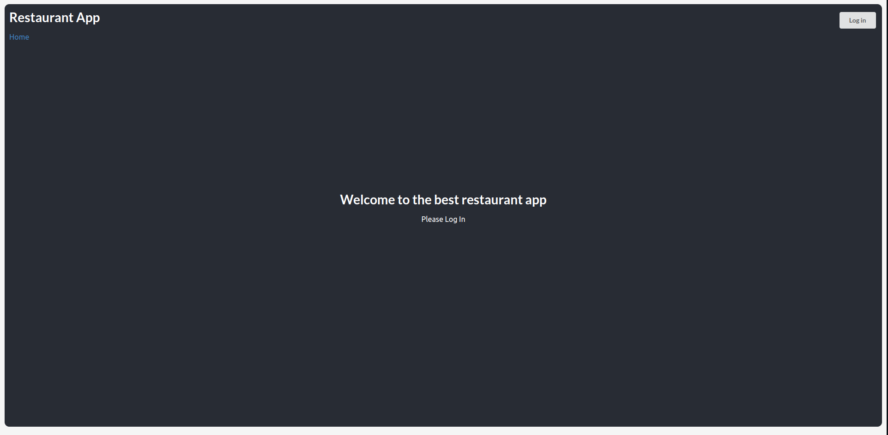
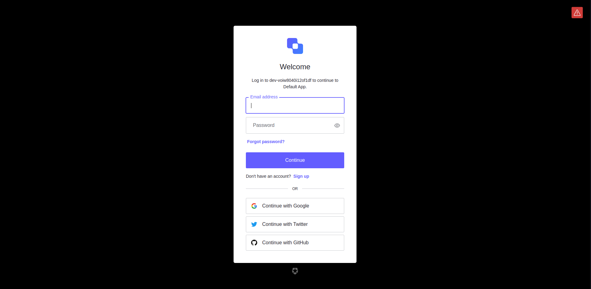
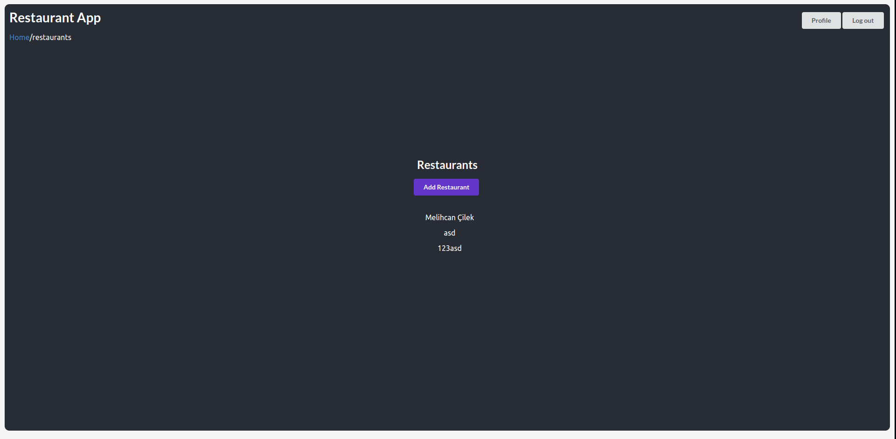
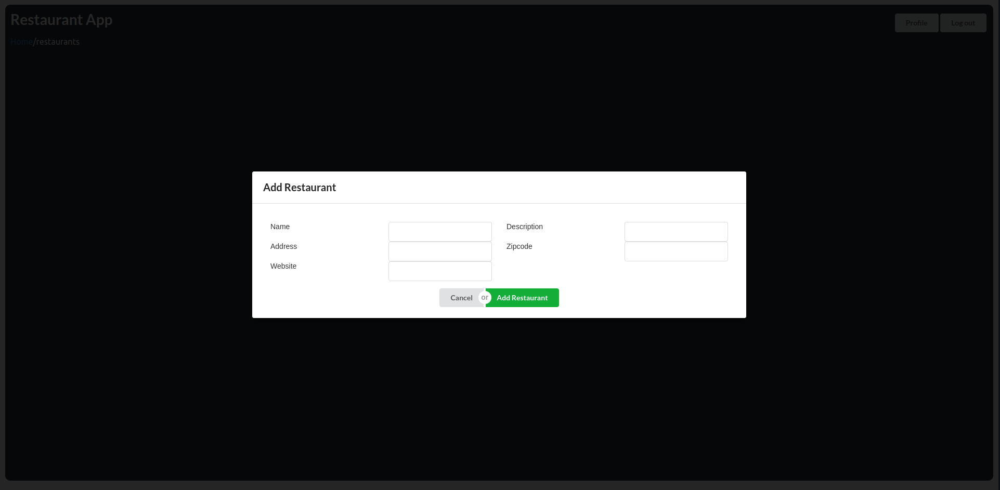
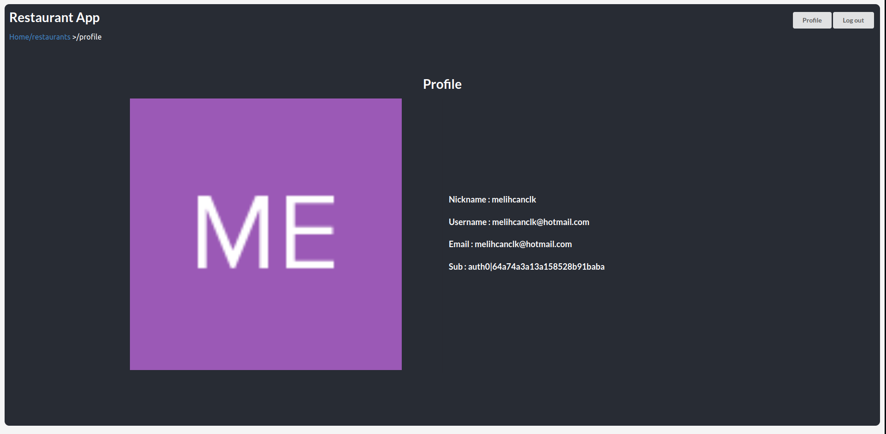
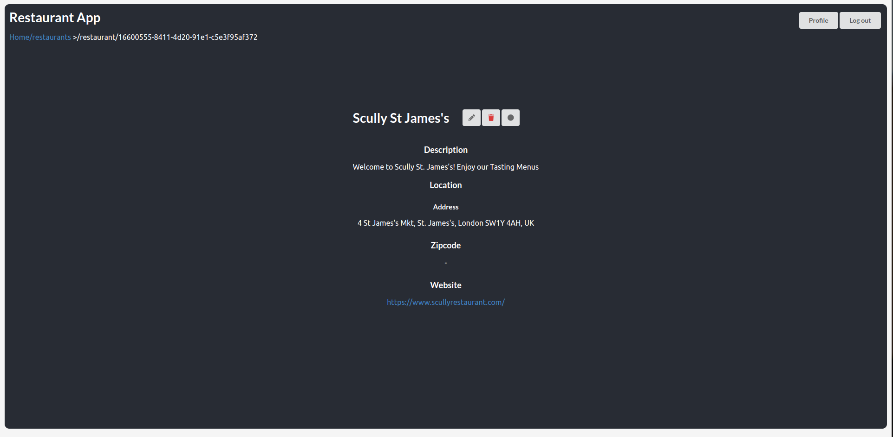
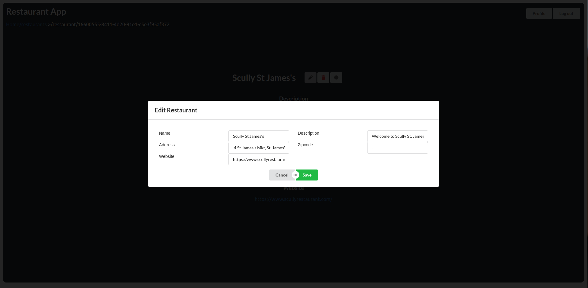

### Installation
1. Clone the repo
   ```sh
   git clone 
    ```
2. Docker Compose
   ```sh
   docker-compose up
   ```

Program will be running on 
```
https://localhost:5173/
```
for frontend and
```
https://localhost:8080/
```
for backend

### Screenshots

##### Login


##### Register


##### After auth


##### Add Restaurant Modal


##### Profile


##### Restaurant Info and Visited Button


##### Edit Restaurant Info



<!-- USAGE EXAMPLES -->

## Tech Stack

### Frontend
Frontend is a simple React app that allows user to add its favourite restaurants to the database. It is connected to the NoSql Casandra database with Document API in and the backend server.

### React
React is used to create the frontend app.

##### [React](https://reactjs.org/)

### Semantic UI
Semantic UI is used to style the frontend app.

##### [Semantic UI](https://semantic-ui.com/)

### Backend
Backend is a simple Node.js server that allows user to perform CRUD operations on restaurants. It is connected to the NoSql Casandra database with Document API in and the frontend server. 

Database management is done with DataStax Astra.
##### [DataStax Astra](https://astra.datastax.com/)

### Authentication
Authentication is done with Auth0. You can create your own account and use it to login to the app.

##### [Auth0](https://auth0.com/)

### Docker
Docker is used to containerize the app. It is used to run the app on the local machine.

##### [Docker](https://www.docker.com/)

### Docker Compose
Docker Compose is used to run the app on the local machine.

##### [Docker Compose](https://docs.docker.com/compose/)

